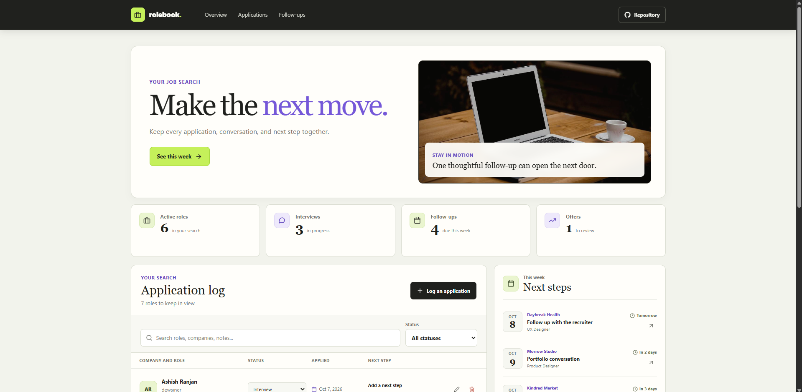

# Rolebook - Job Application Tracker

Rolebook is a personal workspace for keeping job applications, interviews, offers, and follow-up tasks organized in one place.

**Live demo:** [https://a2rp.github.io/job-application-tracker/](https://a2rp.github.io/job-application-tracker/)

## What is included

- An overview of active roles, interviews, follow-ups due in the next seven days, and offers.
- An application log with company, role, location, work mode, status, date applied, and next step details.
- Search across company, role, location, status, next step, contact name, and notes.
- A status filter and quick status changes in the application list.
- A follow-up panel ordered by date. It highlights overdue items and provides a shortcut to edit an application.
- A form to add and edit application details, including salary range, contact, job link, and notes.
- A custom confirmation dialog before removing an application.
- A responsive fixed header with section navigation and a link to the public source repository.
- A floating Back to top button after scrolling more than 50 pixels.
- A footer with the project source and profile, contact, and support links.

## How to use it

1. Review the overview cards to see the current search totals.
2. Use **Log an application** to add a role. Company, role, status, work mode, and applied date are required.
3. Change a role's status directly in the list, or choose a status from the filter to narrow the list.
4. Search using a company, role, location, status, next step, contact name, or note.
5. Use the edit button on a row or follow-up to update its details.
6. Select the remove button to review a custom confirmation before deleting a role.
7. Add a next step and date to an application to place it in the follow-up panel. The panel shows the five soonest dated next steps for active applications.

The overview counts all non-closed applications as active. Screening and Interview statuses count as interviews. Follow-ups due from today through the next seven days contribute to the weekly total. Offers are counted by their Offer status.

## Saving and privacy

Application records are saved in the browser's `localStorage` on the current device. They are not sent to a server and are not synchronized to another browser or device. Clearing this browser's site data removes the saved list. The first visit starts with example records; after the first change, the browser's saved list is used on later visits. If browser storage is unavailable, changes remain only until the page is closed and the app displays a notice.

## Run locally

Use Node.js and npm, then run these commands from the project folder:

```sh
npm install
npm run dev
```

Vite prints the local address in the terminal. Open that address in a browser.

## Code checks and production build

```sh
npm run lint
npm run build
npm run preview
```

ESLint checks the source files. The build command creates the production site in `dist`. The preview command serves that built site locally.

## Deploy

The public site is hosted with GitHub Pages from the `gh-pages` branch. The deployment command builds the site first, then publishes `dist`:

```sh
npm run deploy
```

**Website:** [https://a2rp.github.io/job-application-tracker/](https://a2rp.github.io/job-application-tracker/)

**Repository:** [https://github.com/a2rp/job-application-tracker](https://github.com/a2rp/job-application-tracker)

## Future improvements

These are possible additions and are not implemented in the current version:

- Export and import application records as a CSV or JSON file.
- Add reminders and calendar export for follow-up dates.
- Add sorting controls for company, status, and application date.
- Add optional cloud storage and account sign-in for syncing between devices.
- Add a dedicated interview history and offer comparison view.

## Links

- Portfolio: [https://www.ashishranjan.net](https://www.ashishranjan.net)
- GitHub: [https://github.com/a2rp](https://github.com/a2rp)
- CodePen: [https://codepen.io/ash1198](https://codepen.io/ash1198)
- LinkedIn: [https://www.linkedin.com/in/aashishranjan](https://www.linkedin.com/in/aashishranjan)
- Facebook: [https://www.facebook.com/theash.ashish/](https://www.facebook.com/theash.ashish/)
- YouTube: [https://www.youtube.com/@ashishranjan-ashz?sub_confirmation=1](https://www.youtube.com/@ashishranjan-ashz?sub_confirmation=1)
- Email: [mailto:ash.ranjan09@gmail.com](mailto:ash.ranjan09@gmail.com)

## Support

- Support: [https://a2rp-donation-page.netlify.app/](https://a2rp-donation-page.netlify.app/)
- Buy Me a Coffee: [https://buymeacoffee.com/ashishranjan](https://buymeacoffee.com/ashishranjan)
- Patreon: [https://www.patreon.com/ashishranjan](https://www.patreon.com/ashishranjan)
